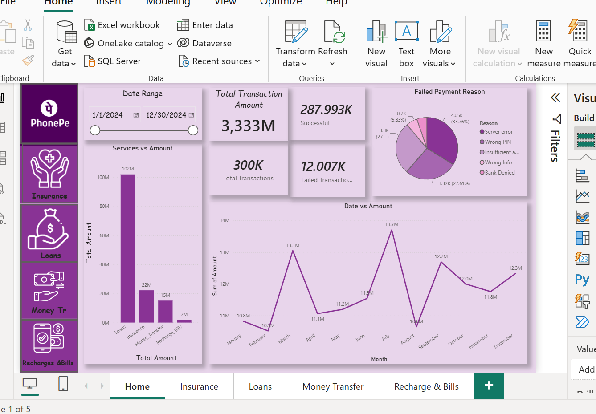

# PhonePe-Data_Analysis-PowerBI
End-to-End PhonePe Transaction Analysis using Power BI

## Project Overview
An end-to-end Power BI dashboard developed to analyze PhonePe
transactions and understand transaction trends, payment status,
failure reasons, and service-wise performance.

## Tools & Technologies
- Power BI
- Power Query
- DAX
- Excel

## Key Analysis
- Analyzed 1,00,000+ transaction records
- Analyzed transaction amount and transaction volume
- Evaluated successful and failed payments
- Identified major payment failure reasons
- Analyzed monthly transaction trends
- Compared performance across different PhonePe services

## Dashboard

## Files
- `PhonePe_Data_Analysis.pbix` – Power BI dashboard 
- `PhonePe_Dataset.xlsx` – Dataset
- `Dashboard.png` – Dashboard preview
